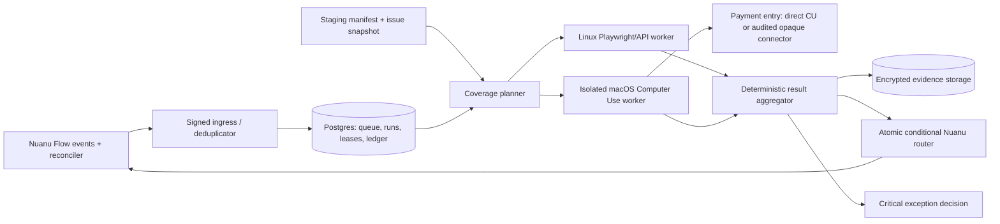

# Freeland Autonomous QA Harness — program design

Date: 2026-07-31

Status: proposed for owner review

Target product: Freeland staging validation plus bounded production canaries

Issue system: Nuanu Flow project `FREEL`

Future product repository: private `FreelandQA`

## 1. Decision

Build a private, product-specific `FreelandQA` repository around a deterministic
TypeScript control plane, a versioned coverage registry, Playwright/API workers,
and an isolated macOS Computer Use worker. Nuanu Flow events enqueue validation;
the harness freezes the issue revision and deployed staging candidate, executes
the required lanes, classifies the result with rules rather than an AI opinion,
stores sanitized evidence, and only then performs an idempotent state change.

The normal QA transition is:

```text
QA
  ├─ verified fixed ───────────────> Ready for prod
  ├─ deterministic product failure > In Progress
  └─ every non-verdict condition ──> remains in QA
```

Computer Use is the first lane for discovering unfamiliar flows and the
authoritative lane for Telegram Web, OS clipboard behavior, explicitly
authorized payment-data entry, provider-hosted navigation, and user-visible
end-to-end certification. Stable assertions are then encoded in Playwright/API
tests for speed and repeatability. High-risk flows run both lanes; Computer Use
does not replace deterministic assertions.

Ordinary staging and production purchases for the allowlisted Freeland
products run unattended after the safety conditions in this design are
implemented. The owner-controlled test-card balance is the primary external
aggregate spend ceiling. The harness additionally enforces environment,
release, merchant, product, quote, currency, recurrence, concurrency, and
reconciliation gates so that a UI or retry defect cannot turn that ceiling
into duplicate or unintended purchases.

## 2. Why the current state cannot safely close the loop

The audit on 2026-07-31 found substantial useful coverage but no reliable
automation boundary:

- The local Freeland suite contains 164 Playwright tests in 24 files. The most
  recent Chromium run had 163 passes and one skip; WebKit had 36 checks with
  expected failures. The product-side CDP harness has 515 combined
  payment/API/reconciliation/security checks.
- The living Freeland matrix contains 161 case rows, but row status mixes full
  automation, partial automation, manual observations, blocks, and
  `test.fail()` expectations. A row count is therefore not a release verdict.
- A real Telegram Web Computer Use attempt and a detailed staging release
  report already exist, but the Telegram attempt deterministically reached an
  ingress `403`; Computer Use scenarios are not executable, versioned assets.
- `docs/local/` and `tests/freeland/` are ignored by Git. A clean CI checkout
  contains none of the 164 Freeland tests.
- The existing GitHub workflow is manual/nightly, Chromium-only, uses the
  production-style variable set, and treats zero selected tests as a valid
  no-op. It has no staging candidate gate, Nuanu event trigger, Computer Use
  lane, or verdict contract.
- Existing project guidance is still partly Linear-centric and encodes the old
  `test.fail()`/Done workflow. The requested workflow is Nuanu Flow
  `QA -> Ready for prod` or `QA -> In Progress`.
- Nuanu Flow had no active reaction automation, process template, or process run
  during the audit. The board is live and changed while it was being read.
- An older release plan pins staging SHA `c702465f…`, while the later audit saw a
  different deployed build (`9ca1dcb3` abbreviated). A static plan cannot prove
  what was actually tested.
- The product-side payment harness lives in a local Freeland worktree with six
  unpushed commits. It covers VPN and virtual numbers, but not eSIM, Card, or
  Passport. Those commits are reviewable locally but are neither upstream nor
  reproducible by clean CI.

The Nuanu snapshot was also risk-heavy and volatile: 199 total issues, 163
active, 105 urgent/high, and 69 active unassigned at the time of the audit.
Twenty-one issues were in QA. Ten had deterministic failing evidence, four were
blocked, five had not been validated against an attested deployment, and only
two were verified passing. Five issues changed state during the read. This
requires snapshot isolation and a final compare-before-write, not a
read-once/process-later script.

The highest-risk clusters that shape this design are:

- Telegram/TMA ingress and environment: `FREEL-209`.
- Cross-run payment idempotency: `FREEL-211`.
- VPN entitlement handoff, copy, and deep-link recurrence:
  `FREEL-206`, `FREEL-207`, and historical `FREEL-55`.
- Payment/provider lifecycle: `FREEL-20`, `21`, `82`, `83`, `84`, `124`,
  `125`, `126`, and `173`.
- Localization, responsive, and accessibility:
  `FREEL-134`, `135`, `136`, `145`, `146`, `148`, `149`, `150`, `152`,
  `159`, `170`, `205`, and `210`.
- CRM/analytics and other external effects:
  `FREEL-103`, `131`, `132`, `147`, and `177`–`180`.

These findings are a bootstrap snapshot, not cached truth. The running system
must re-read all active issues and the deployed manifest on every decision.

## 3. Goals

1. Represent every active Freeland user flow and ticket acceptance condition in
   a versioned coverage registry.
2. Validate every issue entering Nuanu Flow `QA` against the exact deployed
   staging candidate and exact issue revision.
3. Exercise the staging web application through both deterministic
   Playwright/API checks and Computer Use where the coverage contract requires
   it.
4. Exercise the Telegram Mini App directly through `web.telegram.org` on the
   isolated Mac worker, while refusing to call it staging evidence unless its
   runtime is attested to the same staging environment.
5. Run allowlisted ordinary staging purchases end to end, including provider
   handoff, payment result, product provisioning, and the post-purchase user
   action.
6. Run the same allowlisted ordinary purchase canaries on production after a
   deployed release, using a completely separate production authorization,
   account, profile, and evidence bundle.
7. Route only conclusive results: fixed to `Ready for prod`, reproducibly broken
   to `In Progress`, and everything else stays in `QA`.
8. Keep the owner out of routine validation. Ask for intervention only when the
   result is genuinely ambiguous, the environment requires a human-only
   challenge, or the action is outside unattended authorization.
9. Make every verdict reproducible from a clean clone, immutable run metadata,
   and sanitized evidence.
10. Scan non-QA columns continuously so coverage and test data can be prepared
   before a ticket reaches QA.

## 4. Non-goals and hard boundaries

- The harness does not deploy Freeland, swap staging with production, push
  product code, or merge an upstream fix.
- Production writes are limited to the explicitly authorized ordinary
  Freeland purchase canary and its unavoidable order/entitlement records on a
  dedicated QA account. Production settings, personal accounts, third-party
  communications, arbitrary data mutation, and financial-product issuance
  remain out of scope.
- An AI agent may interpret a ticket, propose coverage, investigate a failure,
  or author a candidate test. It may not unilaterally turn an ambiguous
  observation into a routing verdict.
- A retry pass, expected failure, skip, zero-test selection, changed candidate,
  changed issue, incomplete cleanup, or unreconciled payment can never produce
  `PASS`.
- The system does not bypass CAPTCHA, 3DS, browser security warnings, provider
  risk controls, or Telegram authentication controls.
- The system does not automatically perform the final action for a financial
  product or financial-account flow, including Freeland Card issuance/opening.
  It may test all preceding screens and contracts. The Passport flow remains in
  this same restricted class until its legal, identity-data, and product
  semantics are classified; it is not assumed to be an ordinary purchase.
- The system does not install or activate a VPN on the Mac worker. It validates
  provisioning data, copy behavior, deep links, and format without changing
  the host's network/security settings.
- Raw PAN/CVV is allowed only inside the explicitly authorized transient
  Computer Use/AppState and restricted payment-evidence boundary in section
  12.2. It may not enter Git, `.env`, Nuanu, general logs/reports, analytics, or
  ordinary evidence. Passwords, auth tokens, personal Telegram data, email
  content, provisioned phone numbers, and VPN credentials remain excluded from
  all published evidence.

## 5. What “100% E2E coverage” means

“100%” is coverage of the explicit product inventory, not an impossible claim
about every browser/device/data permutation.

### 5.1 Inventory sources

The registry is built and continuously reconciled from:

1. Product routes, navigation, feature flags, and environment manifest.
2. Public and authenticated API/action contracts.
3. Product catalog entries and every purchase/provisioning lifecycle.
4. The existing 161-row test matrix and 164 Playwright tests.
5. Active and historical Nuanu Flow tickets in every state.
6. Freeland staging-versus-production source/change manifests when available.
7. Telegram Mini App entry, launch parameters, and user-visible flows.
8. External effects: payment providers, CRM, analytics, email, and Telegram.
9. Required locale, viewport, engine, accessibility, and failure-mode variants.

Duplicate cases are merged by requirement, not by similar test title. A
requirement can have several execution variants and several requirements can
share a setup.

### 5.2 Coverage accounting

Every leaf requirement has exactly one lifecycle status:

- `AUTOMATED`: an authoritative executable check exists.
- `CANDIDATE`: an automatically generated check is being calibrated and cannot
  yet route a ticket.
- `BLOCKED`: an external or environment prerequisite is unavailable, with a
  reason, owner, first-seen time, retry policy, and expiry.
- `INAPPLICABLE`: the flow is demonstrably disabled for this candidate, with
  manifest evidence and an expiry.
- `MISSING`: no adequate check exists.

The dashboard reports inventory coverage, executable coverage, and current
candidate pass rate separately. `BLOCKED`, `INAPPLICABLE`, `CANDIDATE`, and
expected-failure cases are never displayed as passing tests.

An issue is eligible for automatic `Ready for prod` only when:

- every selected acceptance requirement is `AUTOMATED`;
- its acceptance requirements, dependency closure, and mandatory area/core
  baseline are selected and executable;
- every required surface/lane combination ran;
- no selected check skipped, expected-failed, retried to pass, or lost cleanup;
- the issue revision and candidate attestation remained unchanged.

This issue decision is separate from the staging-candidate release decision. A
ticket can be verified fixed while an unrelated P0, public-ingress, or provider
problem blocks replacing production. `CANDIDATE_RELEASE_READY` requires the
entire release registry: every mandatory P0/P1 flow, full public/mesh/TMA
surface policy, release browser/locale/viewport matrix, and all required
payment/external-effect canaries. `Ready for prod` is therefore not itself a
SHIP verdict.

### 5.3 Required product dimensions

The initial complete inventory must cover:

- guest landing, routing, metadata, PWA/service-worker behavior, and errors;
- sign-up, sign-in, session restoration, relink, logout, and recovery;
- store discovery, categories, product details, eligibility, and empty/error
  states;
- VPN, eSIM, virtual number, Card, and Passport pre-purchase flows;
- allowlisted live purchase and provisioning lifecycles;
- wallet balances, supported top-up methods, address/invoice creation,
  settlement/history, interrupted and late callbacks, and duplicate-credit
  prevention;
- post-purchase activation, renewal, expiry, cancellation/refund visibility,
  failed provisioning, and recovery;
- Inbox/SMS reception, mail alias lifecycle, support submission/response,
  settings, Freeman actions/history, referrals/reward claims, and Telegram
  linking/relinking;
- positive and negative role/authorization paths for regular, operator, and
  admin personas;
- push-permission and real PWA install/offline/update lifecycle where the
  candidate exposes those capabilities;
- Russian and English UI, persistence, formatting, and backend error copy;
- 320, 375, 768, 1024, and 1440 widths, plus touch behavior;
- Chromium and WebKit release gates;
- keyboard, focus, names/labels, dialogs, landmarks, contrast/touch-target
  checks where automatable, with manual WCAG certification explicitly excluded;
- direct web and direct Telegram Mini App entry;
- first-party API authorization, validation, capability, sanitization, and
  environment isolation;
- payment, CRM, analytics, email, and Telegram external-effect contracts;
- offline, timeout, retry, refresh, back-navigation, duplicate-click, and
  interrupted-return failure modes.

## 6. Repository topology

### 6.1 Ownership

`NuanuFlowQA` remains the generic reusable template and skill source.
Product-specific assets move to a new private `FreelandQA` repository and
become normal tracked files. The initial repository is self-contained rather
than a Git submodule: CI for a private submodule adds credential and atomicity
failure modes without providing value at the current scale. Generic libraries
can become a pinned private package after a second product needs the same
control plane.

The proposed top-level shape is:

```text
FreelandQA/
  apps/controller/             event ingress, planner, classifier, router
  apps/mac-worker/             signed Computer Use job adapter
  packages/contracts/          schemas shared by controller and workers
  packages/playwright-support/ fixtures, reporters, environment guards
  coverage/                    flow and ticket-to-requirement registry
  config/environments/         non-secret environment contracts
  config/payment-profiles/     non-secret allowlists and limits
  scenarios/computer-use/      versioned semantic CU scenarios
  tests/playwright/            public, auth, API, TMA-web, payment assertions
  db/migrations/               durable state and payment ledger
  patchsets/freeland/           temporary verified product patch series
  docs/                        architecture, runbooks, reports, decisions
  .github/workflows/           deterministic and release workflows
```

Secrets are injected at runtime from GitHub Environments for Linux workers and
macOS Keychain/dedicated browser profiles for the Mac worker. CVV is the
exception: it is one-attempt transient input and is not retained in those
stores. `.env` remains a local developer convenience and is never the
production secret store.

### 6.2 Temporary product patchsets

Until Nikita accepts the six product-side payment-harness commits upstream,
`FreelandQA` stores them as a versioned patch series, not as an untracked
worktree:

- immutable base product SHA and tree hash;
- ordered patch files generated from the local commits;
- expected patched tree hash;
- source commit subjects and author dates;
- upstream PR/commit reference when it exists;
- automated clean-apply, build, unit, and security checks.

This is what “verified patchset” means: CI can apply the exact reviewed changes
to the exact base and prove the result. It does not mean deployed, merged, or
owned by the Freeland product repository. The series is deleted from active
use after the equivalent upstream commit is verified, while its manifest stays
in historical run records.

## 7. Runtime architecture



### 7.1 Controller

A Node.js/TypeScript service owns:

- signed Nuanu webhook intake and periodic reconciliation;
- issue/candidate snapshotting and idempotency;
- coverage selection and dependency expansion;
- Postgres-backed job dispatch;
- persona, environment, and payment leases;
- result schema validation and deterministic classification;
- evidence indexing and redaction status;
- Nuanu comments, labels, and state transitions with read-back.

Postgres is both system of record and durable queue so the first implementation
does not need Redis. S3-compatible encrypted object storage holds artifacts;
Git and Nuanu contain only sanitized summaries, hashes, and expiring/internal
links.

### 7.2 Workers

- The Linux worker runs API checks, Chromium/WebKit Playwright suites, static
  registry validation, and non-GUI provider reconciliation.
- The macOS worker runs a dedicated QA macOS user with dedicated Chrome
  profiles for staging and Telegram Web. It accepts signed, expiring jobs,
  obtains a scenario by immutable revision, and returns machine-verifiable raw
  observations plus redacted evidence; the controller computes checkpoints.
- Both workers use short-lived controller credentials, heartbeat while holding
  a lease, and cannot request arbitrary URLs or commands. Allowed origins and
  actions come from the signed job envelope.
- A worker loss expires the execution lease but never the payment lease.
  Payments remain blocked until reconciliation proves their terminal state.

## 8. Versioned contracts

### 8.1 Coverage record

Each requirement is a reviewed YAML document validated by JSON Schema. A
representative record is:

```yaml
id: PAY.VPN.CARD.PROVISION_AND_COPY
title: Card purchase provisions VPN and exposes a usable copy action
risk: P0
areas: [store, payments, vpn]
surfaces: [staging-web]
lanes:
  required: [api, playwright, computer-use]
personas: [paid-clean-account]
preconditions: [candidate-attested, no-active-checkout]
assertions:
  - quoted product, amount, currency, and recurrence match the payment profile
  - exactly one checkout is created
  - the order reaches paid
  - the entitlement reaches provisioned
  - Copy places a non-empty valid VPN value on the OS clipboard
cleanup: retire-account-after-entitlement
paymentProfile: vpn-card
paymentOutcome:
  expectedCheckoutCount: 1
  expectedSubmittedPaymentCount: 1
  expectedChargeCount: 1
  expectedRefundCount: 0
  expectedTerminalState: RECONCILED
ticketRefs: [FREEL-55, FREEL-206, FREEL-207, FREEL-211]
```

The registry also stores route/locale/viewport/engine variants, external-effect
requirements, prerequisite case IDs, authoritative assertion source, owner,
and review revision. Ticket references are many-to-many and do not replace
behavioral requirements.

### 8.2 Issue snapshot

At enqueue time the controller stores:

- issue ID/key, project, state, priority, assignee, and labels;
- title, description, acceptance text, attachment hashes, and relationships;
- Nuanu `updated_at` or equivalent revision token;
- activity-history evidence for the prior development state/assignee when the
  API supplies it; otherwise an explicit `unknown`;
- parsed requirement IDs and the parser version;
- event ID and receipt time.

Before routing, the controller re-reads the issue. Any material change or human
state move marks the run `STALE`; the result is preserved but no mutation is
made. If the issue is still in QA, a new run is coalesced onto the latest
revision.

### 8.3 Candidate snapshot

Before and after execution the controller records:

- requested public origin and resolved origin;
- `appEnv`, public origin, full Git SHA, build time, and capability flags from
  the deployed environment manifest;
- relevant bundle/service-worker identifiers;
- server time and worker-observed time;
- selected integration modes and product-catalog digest;
- transport lane: `public`, `mesh`, or `telegram-web`.

For QA issue validation, the origin must be the staging allowlist and `appEnv`
must be staging. For the separate post-deploy canary, the origin must be the
production allowlist and `appEnv` must be production. Environment profile and
manifest must agree; a SHA change during the run makes it stale. A ticket
referencing a fix commit/PR that is not represented by the staging manifest is
`AWAITING_DEPLOYMENT`, not failed and not passed.

Telegram Web evidence has an additional runtime-attestation field. Because the
user confirmed that staging currently exists only in the web application, the
direct Mini App lane can provide production-compatibility information but
cannot promote a staging ticket unless the Mini App itself proves it targets
the same staging backend/candidate. Otherwise its stage-specific requirement
is `ENV_BLOCKED`.

Public ingress and mesh are distinct surfaces even when both display
`https://mf0.forum`. The manifest records the worker route and resolved network
target. Mesh is a diagnostic/internal transport and can never substitute for a
required advertised-public-ingress or Telegram release gate.

### 8.4 Run identity and state

The idempotency key is a hash of:

```text
issue ID + issue revision + candidate SHA + coverage revision
+ classifier-policy revision + execution mode + transport lane
+ catalog/integration-mode digest
+ payment-policy/profile/authorization revision when applicable
```

Only one active run per key exists. Run states are:

```text
QUEUED -> ATTESTING -> PLANNING -> EXECUTING -> RECONCILING
       -> CLASSIFIED -> ROUTING -> DONE
```

Terminal side states are `STALE`, `CANCELLED`, and `INTERNAL_ERROR`. Every
transition is append-only audited with actor, timestamp, and prior/new value.
Before classification and again before routing, the controller re-resolves
every component of the identity. A change to coverage, classifier policy,
catalog, integration/provider mode, transport, payment policy/profile, or
payment authorization makes the old run `STALE` just like an issue or SHA
change.

## 9. End-to-end operating loop

### 9.1 Pre-warm from every board column

A scheduled reconciler scans all active Nuanu states. For Triage, Backlog, Todo,
and In Progress it:

- clusters related and duplicate bugs;
- maps tickets to existing requirements;
- identifies missing coverage and test-data needs;
- generates candidate Computer Use and Playwright checks in a branch;
- runs non-routing calibration against staging;
- watches referenced fix PR/commit deployment.

This preparation does not change ticket state. It reduces QA latency and is how
new work is covered before reaching QA.

### 9.2 Trigger

The authoritative trigger is a watermarked Nuanu reconciliation scan every 60
seconds. A state-change reaction/webhook becomes a low-latency wake-up
optimization only after its event schema, delivery semantics, and signature or
shared-secret verification are proven against the installed Nuanu capability.
Duplicate observations are coalesced by the run identity.

The trigger matches the exact Freeland project UUID and exact `QA` state UUID.
It never matches only a state name or Plane state group: `QA` and
`Ready for prod` currently both belong to the `started` group. The configured
`QA`, `In Progress`, and `Ready for prod` UUIDs are resolved and read back at
startup; a missing or changed mapping pauses routing.

### 9.3 Eligibility and freeze

The controller:

1. Re-reads the issue and verifies project/state.
2. Freezes the issue revision and any history-proven prior assignee/state.
3. Attests the staging candidate.
4. Verifies that referenced code is deployed.
5. Expands ticket requirements with mandatory area and P0/P1 baselines.
6. Verifies coverage maturity, worker health, persona availability, and
   payment/provider prerequisites.
7. Acquires issue, persona, environment, and—when needed—payment leases.

An unmet prerequisite produces a typed non-verdict result; it never silently
reduces the selected suite. `MISSING` or uncalibrated `CANDIDATE` coverage is a
`HARNESS_FAIL` with a coverage-gap incident when expected behavior is clear;
ambiguous expected behavior is `NEEDS_HUMAN`.

### 9.4 Execution

1. API probes establish environment, auth, catalog, and existing-state facts.
2. Playwright runs with `retries=0` for verdict evidence.
3. Computer Use executes every scenario required by risk/surface policy.
4. Payment scenarios run through the separate ledger protocol in section 12.
5. External effects are reconciled through observable APIs/UI and not inferred
   from a success toast.
6. Cleanup/reset executes and is itself asserted.
7. The manifest and issue are re-read.

Retry and `repeat-each` runs are diagnostic children of the verdict run. Their
results help distinguish product failure from flake but cannot overwrite the
original clean-run fact.

### 9.5 Classification and routing

The aggregator consumes only schema-valid results and applies the rules in the
next section. It writes a decision record before any Nuanu mutation. The router
adds one idempotently marked comment and may update labels/state only through a
Nuanu server operation that atomically checks the expected project, state, and
revision. It then reads the issue back and records the verified result.

The currently observed `update_issue` contract does not expose that conditional
write. A local `read -> verify -> write -> read` sequence is not
compare-and-swap and is allowed only in shadow mode because a human can edit or
move the issue between its read and write. Automatic state routing remains
disabled until Nuanu exposes an atomic conditional transition or an equivalent
server-side process step.

## 10. Verdict model

The classifier emits two independent outputs:

- `issueVerdict`, used only for the ticket transition table below;
- `candidateVerdict` with `CANDIDATE_RELEASE_READY`,
  `CANDIDATE_RELEASE_BLOCKED`, or `CANDIDATE_RELEASE_INCONCLUSIVE`, used only by
  the staging-to-production release gate.

An unrelated global failure can block `candidateVerdict` without changing a
correct `issueVerdict=PASS`. A related failure in the issue dependency closure
blocks both.

| Classification | Meaning | Nuanu action |
|---|---|---|
| `PASS` | All mandatory assertions passed under one unchanged issue/candidate, with complete cleanup and reconciliation | Comment + evidence; move to `Ready for prod` |
| `PRODUCT_FAIL` | Correct expected behavior failed deterministically and reproduced in an independent fresh context at the same SHA | Comment + evidence; move to `In Progress`; restore prior assignee when known |
| `AWAITING_DEPLOYMENT` | Referenced fix is absent from the attested staging candidate | Stay in `QA`; comment once; requeue on manifest change |
| `ENV_BLOCKED` | Staging, worker, auth, TMA staging route, or required internal dependency is unavailable | Stay in `QA`; label/retry/alert |
| `PROVIDER_BLOCKED` | Third-party provider, 3DS, CAPTCHA, or provider risk control prevents a verdict | Stay in `QA`; label/retry/alert |
| `HARNESS_FAIL` | Selector, worker, schema, fixture, redaction, or controller failure invalidates evidence | Stay in `QA`; create harness incident; retry after repair |
| `FLAKY` | Clean attempts disagree or a retry-only pass occurs | Stay in `QA`; quarantine routing and investigate |
| `NEEDS_HUMAN` | Acceptance criteria are ambiguous, evidence lanes conflict, or a required action is human-only | Stay in `QA`; create a focused exception decision |

The router restores an assignee only from verified issue activity/history. If
history is unavailable, it moves a conclusive failure to `In Progress` without
inventing an assignee and flags ownership in the comment.

### 10.1 Exact `PASS` predicate

`PASS` requires all of the following:

- issue still in `QA` at the frozen revision;
- identical full staging SHA before and after;
- non-empty selected requirement set;
- every required case executed in the strict lane;
- every required lane/surface returned schema-valid success;
- zero skips, expected failures, unexpected failures, flaky results, or retries;
- no console/network/security failure outside an explicit exact allowlist;
- no unresolved P0/P1 related regression;
- cleanup complete and persona state reconciled;
- for a successful live-purchase requirement, exactly one submitted/reconciled
  charge plus expected provisioning and post-purchase action;
- for decline, cancel, quote-rejection, failure, refund, and other negative
  payment requirements, the exact registry-declared terminal ledger outcome,
  including zero submitted charge where required;
- no payment requirement has an unknown checkout or unresolved provider state;
- evidence redaction passed and the evidence index is durable;
- a second independent lane agrees for P0/P1, payment, auth, Telegram, visual,
  accessibility, clipboard, and external-effect tickets.

`test.fail()` may remain in a diagnostic compatibility suite, but its expected
status is always non-passing in the strict verdict reporter. Fix verification
uses the correct-behavior assertion as a normal strict assertion.

### 10.2 Exact `PRODUCT_FAIL` predicate

`PRODUCT_FAIL` requires:

- an explicit expected behavior sourced from the ticket or reviewed registry;
- failure at the intended behavioral assertion, not setup/selector/timeout;
- fresh-context reproduction at the same candidate and locale;
- hydration, rollout, bot protection, test-data contamination, provider status,
  and duplicate selectors excluded;
- two deterministic observations, or agreement between independent Playwright
  and Computer Use/API evidence;
- successful evidence redaction and no newer issue revision.

Conflicting lanes, a failure only after a retry, or a failure at an unrelated
baseline becomes `FLAKY`, `HARNESS_FAIL`, or `NEEDS_HUMAN`, never an automatic
return to development.

## 11. Playwright/API and Computer Use responsibilities

### 11.1 Playwright/API

Playwright/API is authoritative for:

- deterministic request/response, authorization, and data-shape assertions;
- route, locale, viewport, engine, keyboard, and failure-mode matrices;
- exact network cardinality and no-request-before-action guarantees;
- clean repeatability and fast full regression;
- post-action state through supported product APIs;
- CI reproducibility.

Tests use accessible roles/test IDs, effect-based waits, fixtures, and page
objects. There are no arbitrary sleeps. Verdict configuration uses
`retries=0`, JSON results, strict non-zero selection assertions, separate
artifact directories, and fail-fast candidate guards.

Network allowlists are exact contracts over origin, path, method, status, and
reason. There is no blanket suppression of `401`, `403`, `429`, console errors,
or third-party failures; a rate limit caused by shared test data is a harness
or environment condition, not invisible success.

### 11.2 Computer Use

Computer Use is authoritative for:

- first-pass exploration of unfamiliar or changed UI;
- Telegram Web and the real Mini App container;
- visible navigation and browser behavior not faithfully represented by DOM
  automation;
- OS clipboard verification for the VPN copy defect cluster;
- provider-hosted page orchestration and direct or connector-assisted
  payment-field entry;
- final visual/user-journey certification for high-risk flows.

Scenarios are semantic documents, not recorded coordinates. Each declares:

- allowed applications and origins;
- persona and preconditions;
- ordered user goals and observable checkpoints;
- exact prohibited actions;
- maximum recovery attempts and timeout;
- evidence-safe and evidence-suppressed checkpoints;
- cleanup and terminal-state assertions.

The worker reads the fresh accessibility tree after actions and prefers element
semantics over coordinates. A coordinate fallback is local to one observation
and is never persisted as the scenario contract.

The worker does not return a trusted free-form `success: true`. It returns
sanitized observations: application/bundle identity, URL/origin transitions,
selected AX nodes/attributes, screenshot hashes or approved crops, network/API
references, and local validators such as `clipboard_format_valid` without the
clipboard value. The controller applies the versioned checkpoint predicates to
those observations; independent API/Playwright state supplies the second
oracle for critical flows.

### 11.3 Trusting newly generated tests

An uncovered QA ticket causes the system to create a `CANDIDATE` requirement
and branch, not to improvise a passing result. A generated check becomes
`AUTOMATED` only after:

1. its expected behavior is traceable to explicit acceptance text or an
   existing reviewed product contract;
2. static checks reject missing assertions, soft assertions, broad exception
   swallowing, uncontrolled external targets, and arbitrary timeouts;
3. its setup and cleanup are repeatable on disposable data;
4. a Computer Use observation and a deterministic API/Playwright assertion
   agree;
5. repeated calibration shows no disagreement;
6. an independent automated review finds no oracle leakage, selector tautology,
   or assertion that merely mirrors implementation data.

Ticket descriptions, comments, and attachments are untrusted test inputs, not
agent instructions. The generation worker has no Nuanu mutation, payment, or
production credential. Candidate code is statically scanned and first executes
in a network-restricted dry environment; staging credentials are granted only
to the signed reviewed scenario selected by the controller.

If the acceptance text is insufficient or the lanes disagree, the ticket is
`NEEDS_HUMAN`. This is the primary precision tradeoff: the system prefers a
visible exception over a false `Ready for prod`.

## 12. Live payment design

### 12.1 Scope

The unattended allowlist initially covers ordinary Freeland purchases:

- VPN;
- eSIM;
- virtual number.

Each product has distinct committed staging and production payment profiles. A
profile specifies the exact Freeland environment and origin, provider origins,
merchant identity, product/SKU, allowed methods, exact
currency, maximum one-charge amount, expected recurrence terms,
provider settlement horizon, account-state preconditions, terminal entitlement,
and post-purchase assertions. It does not define or increase live-purchase
cardinality.

Staging and production never share a run, QA account, order/entitlement,
authorization row, catalog digest, or evidence bundle. They may reference the
same securely stored test-card alias, but the global instrument mutex prevents
concurrent use. A staging canary cannot satisfy a production requirement and a
production canary cannot retroactively validate staging.

Each environment/release/product submits through exactly one profile-selected
surface. Other applicable surfaces exercise the full dry path up to Submit and
then verify the resulting entitlement from their own UI. This preserves
cross-surface E2E coverage without multiplying live charges. Today the staging
surface is web-only; a production profile may select public web or the attested
Telegram Mini App.

Freeland Card final issuance/opening is a financial-product action and requires
human handoff. Passport final submission remains restricted until classified.
The harness still automates their catalogs, eligibility, forms using synthetic
non-sensitive data, validation, quote, disclosures, navigation, cancellation,
and all steps before the restricted final action.

### 12.2 Payment-data handling

The owner explicitly authorizes transmission of the supplied PAN, expiry data,
and CVV to the allowlisted Freeland/acquirer payment form through Computer Use.
Those values may appear transiently in `node_repl` action arguments,
accessibility/AppState output, screenshots, and the raw evidence-processing
buffer. Their presence inside this declared payment-data boundary is not a
`HARNESS_FAIL`.

That permission changes the capture boundary, not every storage boundary:

- Computer Use direct-entry mode may use `set_value`/`type_text` for the
  focused, origin-verified payment fields. The controller sends payment values
  only to the single leased Mac job and never embeds them in a scenario,
  repository file, `.env`, test, ticket, or general controller payload.
- The dedicated Chrome profile remains `Freeland QA Payments`. PAN, expiry, and
  cardholder data may instead be supplied through the independently audited
  `freeland-payment-connector` or a provider token; the connector is a privacy
  optimization, not a prerequisite for direct Computer Use entry.
- Systems that can see raw PAN/CVV—including the Computer Use provider,
  AppState store, and raw evidence buffer—are treated as part of the payment
  data environment: access-controlled, encrypted in transit, fully audited, and
  excluded from ordinary QA logs and artifacts.
- A full PAN captured in raw evidence is encrypted at rest, access is limited
  to the payment-incident role, every access is audited, and the raw object is
  deleted within 24 hours. The same maximum TTL applies to every durable
  PAN-bearing copy in Computer Use tool arguments, provider job logs, AppState,
  screenshots, buffers, or object storage. The normal durable derivative masks
  PAN and removes payment-field values before Nuanu delivery.
- CVV may exist in memory, Computer Use/AppState, and a pre-authorization raw
  capture, but it is never written to Keychain, browser card-on-file storage,
  Postgres, object storage, or any retained evidence after authorization. The
  payment-data scrubber zeroizes/removes every tool/evidence copy at a mandatory
  pre-Submit barrier; Submit is disabled until deletion receipts and independent
  tombstone checks produce `CVV_SCRUB_CONFIRMED`. Provider events,
  decline/failure, submit timeout, worker lease loss, and a hard ten-minute TTL
  from first capture are additional recovery triggers. On lease loss or hard
  TTL the independent browser watchdog also closes the payment tab/context to
  remove the live form value.
- Direct Computer Use entry is enabled only when the Computer Use job/artifact
  backend has backend-enforced TTL/deletion for CVV-bearing tool arguments,
  AppStates, and screenshots independent of a live Mac worker or controller.
  If that backend retains an immutable CVV copy, the harness must use the
  connector/token path or classify the live run `HARNESS_FAIL`.
- A non-secret `payment_data_artifacts` inventory records every system/object
  that may contain PAN/CVV, its data class, creation time, mandatory deletion
  deadline, deletion attempt, backend receipt, and verified tombstone. The
  independent scrubber consumes provider events and lease/timeout recovery; it
  does not depend on the payment worker completing its callback.
- Git, Nuanu comments/attachments, Playwright HTML/JUnit/JSON reports,
  application logs, analytics, and routine screenshots always receive the
  sanitized derivative, never full PAN or CVV.

This distinction is mandatory even with owner permission. PCI SSC treats
images containing card data as in scope, requires stored PAN to be rendered
unreadable, and prohibits retaining CVV after authorization even when the
cardholder asks for it or the value is encrypted:
[PCI SSC FAQ 1070](https://www.pcisecuritystandards.org/faqs/1070/),
[FAQ 1222](https://www.pcisecuritystandards.org/faqs/1222/), and
[FAQ 1280](https://www.pcisecuritystandards.org/faqs/1280/).

For repeated unattended purchases, the preferred rail is a provider token or
card-on-file reference created by the first authorized transaction. If the
provider requires CVV again, a fresh one-time value may be supplied transiently
to that specific Computer Use run, but it is not retained after the attempt.
Without a tokenized rail or fresh one-time CVV input, that run is
`NEEDS_HUMAN`; the harness does not create a persistent CVV store to avoid the
gate.

### 12.3 Durable ledger

`FREEL-211` is a launch blocker for unattended charges. The ledger lives in
Postgres and has database uniqueness constraints, not a local file lock.

Before an intent exists, the controller derives one global live-canary
authorization key:

```text
immutable owner-authorization-scope ID
+ environment + full deployed release SHA + product/SKU
```

The owner-authorization scope is provisioned outside ticket/run input and
cannot be minted by a planner or worker. Merchant, method, quote, recurrence,
account, payment profile, and canary purpose are validated attributes of its
single authorization row, not key dimensions that can create another slot. It
deliberately excludes issue ID, run ID, account, run purpose, profile revision,
merchant, method, canary class, and caller-supplied ordinal.

The authorization row owns one canonical payment intent and fixes both
`max_checkouts_created=1` and `max_submitted_payments=1`. The database rejects a
second intent or checkout for that row. Every later ticket/run resumes or
reconciles the canonical checkout rather than creating another one. A second
live payment for the same environment/release/product requires a separately
provisioned, owner-approved exceptional authorization scope ID.

The state machine is:

```text
DISCOVERED
  -> PRECHECKED
  -> LEASED
  -> CHECKOUT_CREATED
  -> ENTRY_FILLED
  -> CVV_SCRUB_CONFIRMED
  -> SUBMIT_FENCED
  -> PAYMENT_SUBMITTED
  -> PROVIDER_PENDING
  -> SETTLEMENT_PENDING
  -> PAID
  -> PROVISIONED
  -> RECONCILED
```

Side states are `DECLINED`, `FAILED_BEFORE_SUBMIT`, `BLOCKED`,
`UNKNOWN_AFTER_SUBMIT`, `LATE_PAYMENT_REVIEW`, `REFUND_REQUESTED`,
`REFUND_PENDING`, `REFUNDED`, and `REFUND_FAILED`. Once a run reaches
`PAYMENT_SUBMITTED`, no new checkout or payment attempt is allowed for that
authorization/environment/release/product, including from a different account,
until authoritative reconciliation reaches a safe terminal state.
Reconciliation does not reset the one-submission cardinality. Worker death
never releases this prohibition.

Creating the canonical checkout, recording `CVV_SCRUB_CONFIRMED`, and moving to
`SUBMIT_FENCED` are atomic write-ahead transitions. The database cannot enter
`SUBMIT_FENCED` without verified scrub receipts/tombstones. It then issues a
monotonically increasing fencing epoch; direct Computer Use, the payment
connector, and the product-side one-checkout gate reject any missing scrub
barrier or stale worker epoch before external Submit. A global mutex over
environment/payment-instrument serializes VPN, eSIM, and virtual-number live
payments in addition to the per-authorization lock.

`DECLINED`, `BLOCKED`, timeout, and late/unknown states never create a new
authorization slot. They consume or resume the canonical intent according to
the provider settlement horizon declared by the profile. Refund initiation is
a separate consequential action and is never inferred from authorization to
purchase; it requires its own owner policy and idempotency key. Without that
policy, the harness only observes and reconciles refund/reversal states.

The ledger stores non-secret identifiers plus an encrypted reversible provider
reconciliation handle in a separately permissioned column/store. The handle is
envelope-encrypted with a KMS key whose decrypt permission belongs only to the
provider-adapter runtime role. Evidence contains only an internal alias and
hash. Signed provider webhook/event IDs are mapped idempotently to the
canonical internal intent.

### 12.4 Automated preflight and quote lock

Before Computer Use opens a provider form, the controller proves:

1. full deployed release SHA and exact authorized staging or production
   environment/origin;
2. committed payment profile and catalog digest;
3. exact product, SKU, amount, currency, recurrence, tax/fee behavior, and
   merchant match the profile;
4. no active/unknown checkout, conflicting entitlement, stale resume key, or
   unresolved prior charge;
5. the account is leased and suitable for an irreversible entitlement;
6. one immutable owner-authorization scope, one canonical intent, and
   `max_checkouts_created=1` are present;
7. the global instrument mutex and fresh fencing epoch are acquired before the
   single checkout/submit idempotency key is armed;
8. provider origin and redirect chain are allowlisted;
9. Linux and Mac workers are healthy and reconciliation endpoints are
   reachable.

The test-card balance remains the owner-controlled primary aggregate cap. A
per-profile single-charge maximum and one-checkout invariant protect against
catalog drift and duplicate UI actions without adding a per-run human gate.

### 12.5 Computer Use execution

The Mac worker:

1. rechecks product/quote/recurrence in visible UI;
2. creates or resumes only the ledger-bound checkout;
3. navigates only through allowed origins;
4. uses the authorization-selected entry mode: direct Computer Use field entry
   with transient PAN/CVV capture allowed, or the audited connector/provider
   token path;
5. runs the pre-Submit scrub barrier, which removes CVV from all tool/evidence
   copies and converts any retained raw frame into a CVV-free encrypted
   PAN-bearing object;
6. obtains `CVV_SCRUB_CONFIRMED` and the fresh submission fencing epoch;
7. submits the ordinary purchase automatically;
8. observes the provider result and return path;
9. publishes only the sanitized evidence derivative;
10. waits for authoritative order and entitlement reconciliation and performs
    the product-specific post-purchase assertion.

Successful live reconciliation is a three-way join:

```text
authenticated provider/acquirer status or verified signed provider event
  <-> exact Freeland order/payment record
  <-> exact provisioned entitlement
```

Every payment profile names its provider adapter and accepted signed event/read
contract. First-party Freeland UI/API state alone is not settlement evidence.
If the provider-side read/event is unavailable or cannot be linked through the
encrypted reconciliation handle, the result is `PROVIDER_BLOCKED`, not `PASS`.

For VPN, the final assertion includes both UI availability and a real OS
clipboard read after the Copy action, validating non-empty structure without
persisting the credential. This directly covers the `FREEL-206/207/55`
recurrence cluster.

A changed quote, new paid add-on, unapproved recurrence, unknown origin,
CAPTCHA, 3DS challenge, security warning, legally binding new terms, or unknown
post-submit outcome stops the run. The result is blocked/unknown and no second
charge is attempted. A CAPTCHA or new binding agreement can be surfaced as a
critical action-time exception; it is never bypassed.

### 12.6 Frequency

- Every new staging candidate receives dry payment coverage for every product
  and method.
- The first release-certification run for a candidate performs one reconciled
  live canary for each impacted allowlisted purchase class.
- After that exact release is deployed to production, a separate post-deploy
  run attests the production manifest/catalog and performs one production
  canary for each impacted allowlisted purchase class under production-only
  authorization rows and QA accounts.
- A payment-related ticket consumes the same global environment/release/product
  authorization. It performs the live canary only if that authorization has
  not already submitted a payment; otherwise it reuses the reconciled evidence
  when still valid.
- Non-payment tickets reuse the immutable live-canary attestation only within
  the same environment/release/profile revision for at most 24 hours and do not
  spend again.
- A candidate, catalog, integration-mode, or payment-profile change invalidates
  reuse.
- A provider-health or redirect-chain change invalidates reuse immediately.

Invalidation on the same environment/release does not mint a second
live-canary authorization. The live requirement remains blocked until a new
release or a separately recorded owner-approved exceptional authorization; dry
and reconciliation checks continue automatically.

This provides real payment coverage without charging once per unrelated QA
ticket and without treating staging payment evidence as production evidence.
A failed production canary raises a production incident and blocks release
completion; it does not automatically deploy, roll back, refund, or mutate an
unrelated QA ticket.

## 13. Test data and persona control

The controller maintains QA-owned persona pools:

- clean guest/new account;
- authenticated unpaid account;
- paid VPN/eSIM/number account;
- Telegram-linked and unlinked accounts;
- locale-specific accounts;
- interrupted-checkout and recovery accounts;
- provider-blocked/negative fixtures where safely seedable.

Every persona is leased to one run. Mutable state has a before/after snapshot
and an explicit cleanup strategy:

- reversible state is reset and asserted;
- irreversible entitlements use a fresh tagged account that is retired;
- unknown state quarantines the persona;
- no run can borrow a quarantined or unreconciled persona.

Production personas form a separate pool from staging personas and are marked
as spend-bearing, non-destructive QA accounts. No storage state, entitlement,
email alias, Telegram session, or cleanup action crosses environments.

Account creation may be automated with QA-owned mailboxes when it introduces no
unexpected legal or privileged-access commitment. Authentication secrets and
mailbox tokens remain in the platform secret store. Telegram Web uses a
dedicated QA Telegram account and bot; it never touches the owner's personal
chats or sends messages to third parties.

## 14. Nuanu Flow integration

### 14.1 Event and reconciliation model

The authoritative path is:

```text
60-second cursor scan -> issue observed in exact QA state -> durable enqueue
```

A periodic scanner uses a persisted watermark and queries all issues updated
since the last successful page. It recovers missed webhooks, detects state
changes, refreshes non-QA pre-warm work, and never assumes a previous board
snapshot is current.

After capability verification, a signed reaction webhook may call the same
idempotent enqueue endpoint and wake the scanner immediately. Failure or
absence of that webhook does not affect correctness.

The scanner and router use the same exact project/state UUID mapping as the
event filter. State-group equality is insufficient for both intake and
compare-before-write.

### 14.2 Safe mutations

Every comment includes a hidden deterministic run marker so delivery is
idempotent. State changes require a Nuanu server-side conditional operation over
the frozen issue revision, expected project, and expected `QA` state. A local
issue lock protects harness workers but cannot protect against a human or
another Nuanu actor and therefore is not sufficient.

The routing summary contains:

- classification and concise rationale;
- candidate full SHA and issue revision;
- requirement/lane counts, including any non-pass status;
- sanitized evidence link and digest;
- payment lifecycle summary without identifiers/secrets;
- next retry or human action, when applicable.

The system never edits title/description/acceptance criteria. It adds only
namespaced QA labels and comments, and changes state according to the verdict
table after the atomic-transition activation gate is met. Until then it
publishes shadow evidence without changing state. A failed mutation or failed
read-back is `HARNESS_FAIL`; it is never reported as routed.

### 14.3 Human exception process

Routine results do not need a BPMN decision. `NEEDS_HUMAN` creates a separate
Nuanu Flow exception process with one resolvable owner. Its structured graph
will contain:

1. start with run/issue/evidence references;
2. webhook refresh of the latest immutable evidence;
3. assigned decision with `ready`, `development`, and `stay_qa` choices;
4. `refine` routed back to an evidence/rerun step;
5. `deny` routed to a separate no-mutation end;
6. one terminal node per chosen mutation, each followed by read-back.

Before activation the graph must be validated with zero errors and zero
warnings, saved, read back, explicitly activated, and exercised in shadow mode.
The process is an exception mechanism, not an AI judge replacing the
deterministic classifier.

## 15. Evidence, privacy, and retention

Each run produces an immutable evidence index with:

- run/issue/candidate/coverage identities;
- worker and tool versions;
- test names and structured assertion results;
- screenshots, video, trace, network summary, and CU checkpoints only where
  allowed;
- redaction manifest and artifact hashes;
- payment state transitions plus hashes/pointers for any separately restricted
  raw payment capture;
- cleanup and route read-back.

Artifacts pass automated secret/PII classification before upload. Authorized
raw PAN capture is routed only to the encrypted payment-evidence store; PAN or
CVV found outside that boundary blocks publication and classification. CVV is
removed by the mandatory pre-Submit scrub barrier plus independent recovery
triggers/TTL and is never a retained post-authorization object. Every potential
payment-data backend/container is
pre-registered in `payment_data_artifacts`; deletion is complete only after a
backend receipt and an independent not-found/tombstone verification. Every
PAN-bearing durable copy is deleted within 24 hours, redacted diagnostic
artifacts after 30 days, redacted verdict bundles after 180 days, and
routing/payment audit metadata after 365 days. A legal or incident hold may
extend sanitized evidence but never CVV or full-PAN retention. Nuanu comments
link only to the redacted bundle rather than embedding raw traces.

## 16. Precision and reliability controls

### 16.1 False-green prevention

- exact issue and candidate snapshot before and after;
- strict zero-retry verdict lane;
- non-zero test-selection assertion;
- no pass credit for skip/expected-fail/quarantine;
- mandatory baseline expansion beyond ticket-specific tests;
- independent lane agreement for high-risk areas;
- authoritative external-state reconciliation;
- explicit cleanup verification;
- stale-result suppression;
- server-side atomic conditional routing and read-back;
- deterministic rules version stored with every verdict.

### 16.2 False-failure prevention

- fresh-context reproduction;
- hydration/effect-based waits and unique selectors;
- pinned locale and persona state;
- provider and environment health probes;
- classification of bot/rate-limit/rollout conditions;
- diagnostic repeat runs that do not rewrite the clean verdict;
- separate harness incidents from product tickets.

### 16.3 Operational safeguards

- global pause switch and per-lane kill switches;
- automatic pause on any duplicate payment, PAN/CVV outside the authorized
  payment-data boundary, failed CVV scrub deadline, PAN copy older than 24
  hours, wrong origin, unexpected Nuanu transition, or false `Ready for prod`;
- bounded concurrency per environment, account, provider, and product;
- signed expiring worker jobs and origin allowlists;
- structured audit trail for every decision and external mutation;
- alert deduplication and escalation only after bounded automated recovery.

## 17. Rollout

### Phase 0 — reproducible private baseline

- Create private `FreelandQA`.
- Migrate and de-duplicate the current Freeland tests/matrix as tracked assets.
- Package the temporary product patchset.
- Make a clean clone enumerate the expected suite.
- Reject zero tests, secrets, or untracked authoritative assets.

Exit: clean CI can reproduce current non-live coverage and patch verification.
No Nuanu routing and no live payment.

### Phase 1 — coverage and deterministic run core

- Add schemas, coverage registry, candidate attestation, strict reporter, run
  database, evidence index, and persona leases.
- Import the current ticket clusters and all current QA acceptance conditions.
- Separate diagnostic expected failures from verdict assertions.

Exit: every current QA ticket maps to explicit requirements and receives a
typed local classification, with no board mutation.

### Phase 2 — Nuanu shadow loop

- Add webhook/reconciler, idempotent issue snapshots, comments in dry-run
  storage, and read-only board comparison.
- Run 30–50 shadow decisions across pass, fail, blocked, flaky, and stale
  examples.

Exit: at least 98% agreement with reviewed outcomes, zero false green, zero
wrong-issue/candidate decisions, and stable event deduplication.

### Phase 3 — Computer Use and Telegram

- Deploy isolated Mac worker and versioned semantic scenarios.
- Certify staging web flows and direct Telegram Web flows.
- Enforce TMA environment attestation and OS clipboard assertions.

Exit: required dual-lane cases agree; loss/restart and evidence-redaction drills
pass.

### Phase 4 — controlled routing

Activation prerequisite: Nuanu provides and the harness verifies an atomic
conditional transition over expected project/state/revision. Without it this
phase stays in shadow/comment-only mode.

1. Publish shadow comments only.
2. Auto-return deterministic `PRODUCT_FAIL` tickets to `In Progress`.
3. Auto-promote low-risk `PASS` tickets.
4. Auto-promote P0/P1 only after mandatory dual-lane evidence.

Each step has an independent kill switch and rollback to shadow mode.

Exit: no false route during the observation window and every mutation has
successful read-back.

### Phase 5 — live payments

- Implement the durable ledger and all `FREEL-211` tests.
- Implement direct Computer Use payment entry and the optional audited opaque
  connector/provider-token path.
- Prove that transient PAN/CVV may flow through the declared Computer Use and
  raw-evidence boundary, while the independent pre-Submit scrub barrier and
  provider/timeout/lease-loss recovery triggers remove CVV and every
  PAN-bearing backend copy has a verified maximum 24-hour TTL.
- Complete any explicitly authorized PAN/expiry/token provisioning into the
  dedicated profile/connector; do not persist CVV.
- Add eSIM and complete virtual-number/VPN profiles.
- Run cross-ticket/cross-account duplicate, worker-loss, redirect,
  unknown-result, worker-death-immediately-after-submit, out-of-boundary
  payment-data, missed-CVV-callback, PAN-TTL, and evidence-redaction fault
  injection.
- Enable one bounded staging canary per impacted class/candidate, then one
  separately attested production canary per impacted class after deployment.

Exit: zero duplicate attempts, zero unauthorized payment-data disclosure, zero
missed CVV scrub deadlines, zero PAN copies older than 24 hours, and verified
paid-to-provisioned lifecycle plus post-purchase action.

### Phase 6 — full inventory and continuous optimization

- Close every `MISSING` active requirement.
- Add proactive checks for tickets before QA.
- Add coverage-drift detection for new routes/catalog/actions.
- Track defects escaped to production and feed them back into the baseline.

Exit: every active inventory leaf is automated, explicitly blocked, or
inapplicable with current evidence; all QA routing follows this design.

## 18. Program decomposition

This program is too large for one implementation plan or one atomic change.
Implementation is split into independently testable subprojects:

1. **Repository baseline and coverage registry**

   Private repo, tracked migration, schemas, clean-clone/zero-test gate, current
   inventory import.
2. **Candidate/run/evidence core**

   Postgres state, queue, manifest attestation, strict reporter, redacted
   evidence, deterministic classifier.
3. **Nuanu event and routing adapter**

   webhook/reconciler, snapshots, comments, state transitions, read-back, shadow
   metrics.
4. **Persona and test-data control plane**

   leases, reset/retire/quarantine, QA mailbox/account automation.
5. **Computer Use and Telegram worker**

   signed Mac jobs, semantic scenarios, direct Mini App, clipboard and
   cross-lane evidence.
6. **Durable payment automation**

   global authorization/ledger, profiles, direct Computer Use entry, optional
   audited connector, payment-data boundary, fault injection, live canaries.
7. **Full-flow certification and optimization**

   remaining inventory, drift detection, release certification, SLOs.

Subprojects execute in that order except that non-mutating coverage authoring
and Mac-worker prototyping may proceed in parallel after subproject 1. Nuanu
auto-routing cannot begin before subprojects 1–3 pass shadow acceptance.
Unattended payment cannot begin before subprojects 1–6 pass their safety gates.

## 19. First implementation boundary

The first implementation plan will cover only subproject 1. Its acceptance
criteria are:

1. A private `FreelandQA` repository exists with branch protection and no
   committed secrets.
2. All authoritative Freeland Playwright tests and safe documentation are
   tracked; local reports, credentials, storage state, and sensitive evidence
   remain excluded.
3. A clean clone installs dependencies, type-checks, and enumerates the agreed
   Freeland staging suite; zero selected tests fails.
4. The current 161-row matrix and 164-test suite are normalized into the
   versioned registry without claiming blocked/partial/expected-fail cases as
   passes.
5. Every current QA ticket is mapped to requirements or explicitly `MISSING`.
6. The six local product commits are represented by a clean-applying patchset
   manifest or are proven equivalent to upstream commits.
7. CI runs registry validation, secret scanning, patch verification, and the
   non-live deterministic suite.
8. No Nuanu issue is mutated and no live purchase is made by this subproject.

Only after this boundary is reproducible should the run database and event loop
be implemented.

## 20. Metrics and service objectives

- False `Ready for prod` for P0/P1: exactly 0.
- False `Ready for prod` overall: below 0.5%.
- False automatic return to development: below 1%.
- Verdict-lane flake rate: below 1%.
- Duplicate or untracked charge: exactly 0.
- PAN/CVV outside the authorized payment-data boundary: exactly 0.
- Durable post-authorization CVV object: exactly 0.
- Missed CVV scrub deadline: exactly 0.
- PAN-bearing copy older than 24 hours: exactly 0.
- Wrong-environment verdict: exactly 0.
- QA-entry to first result: p50 under 15 minutes, p95 under 60 minutes,
  excluding provider/environment blocks.
- Event delivery: no permanently missed QA transition; reconciler recovers all
  webhook loss.
- Coverage: 100% of active inventory accounted for, with pass percentage
  reported separately from blocked/inapplicable/missing.

## 21. Failure recovery and rollback

- Controller restart resumes durable queued/running jobs from leases.
- Linux/Mac worker loss marks non-payment execution retryable; payment execution
  enters reconciliation before any new action.
- Provider authorization/decline events, submit timeout, and payment-worker
  lease loss independently enqueue the payment-data scrubber; startup recovery
  scans every overdue `payment_data_artifacts` record before enabling payments.
- Manifest change cancels routing and queues a new candidate run.
- Issue change cancels routing and queues the latest revision if still in QA.
- Nuanu API failure retries the same idempotent mutation and verifies read-back.
- Evidence scan/storage failure prevents verdict publication.
- Any safety invariant breach flips the affected lane—and for duplicate charge,
  wrong origin, out-of-boundary payment data, missed CVV scrub deadline, or PAN
  older than 24 hours the entire system—to shadow/pause mode.
- State rollback means stopping automation and moving no further issues; it
  does not automatically undo a human-reviewed board transition or attempt an
  unsafe compensating financial action.

## 22. Completion criteria for the program

The autonomous loop is complete only when:

- clean-clone CI contains and executes the real Freeland suite;
- every active product flow and QA acceptance condition is represented in the
  coverage registry;
- exact candidate and issue snapshots are enforced;
- both staging web and attestable Telegram Mini App surfaces have executable
  coverage;
- Computer Use scenarios are versioned and reproducible on the isolated Mac;
- ordinary allowlisted payments are ledger-backed, securely entered,
  reconciled, and provisioned without duplicate attempts; explicitly
  authorized PAN/CVV capture remains inside the declared payment-data boundary
  with independent crash-safe CVV scrubbing and a verified inventory/TTL for
  every PAN-bearing copy;
- production payment canaries use production-only attestation, account,
  authorization, catalog, and evidence and never reuse staging verdict data;
- strict classifications route correctly in Nuanu with read-back;
- 30–50 shadow decisions meet the precision targets before any automatic route;
- all human intervention is limited to typed critical exceptions;
- the kill switches, stale-run handling, worker-loss recovery, payment unknown
  state, payment-data-boundary, CVV-scrubber, PAN-TTL, and wrong-origin drills
  have passed.

This design intentionally prioritizes false-green prevention over maximum
automatic throughput. A ticket remaining visibly in QA is recoverable; a false
promotion immediately before staging replaces production is not.
